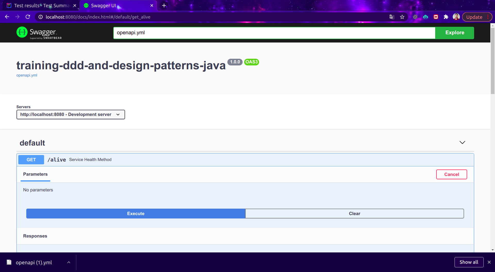
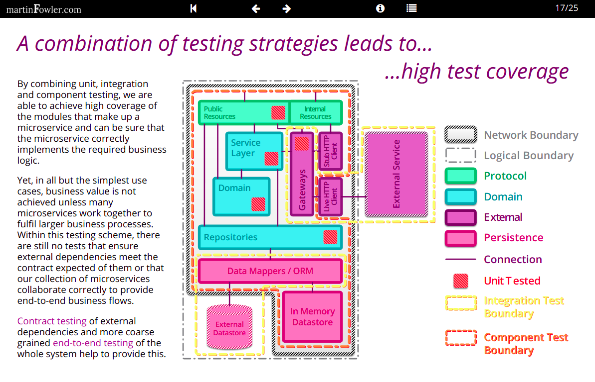
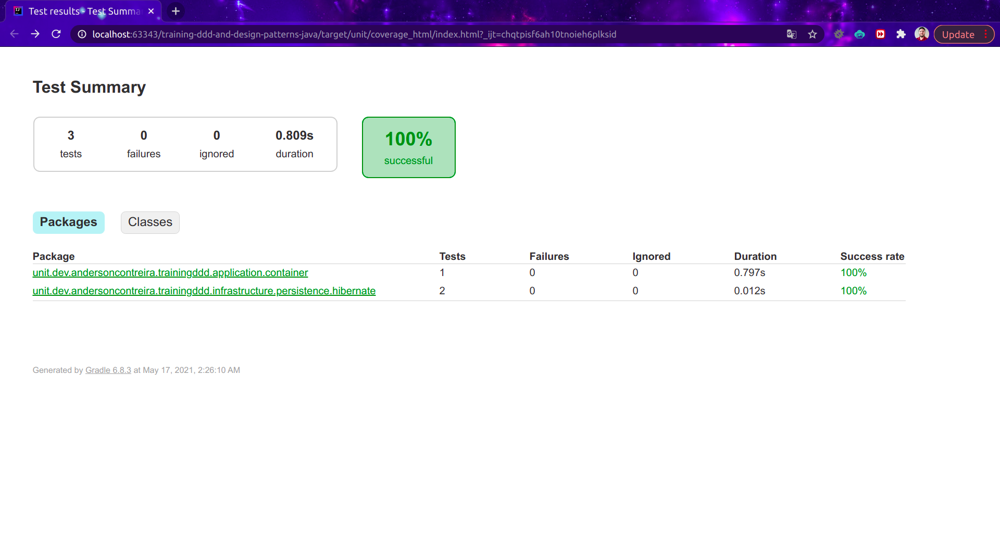

# Training DDD and Design Patterns in Java
DDD and design patterns sample in Java.
Hybrid project to run SpringBoot our Spark.

## Service Architecture
This service is the main part of the follow architecture.

[comment]: <> (![Architecture]&#40;docs/ddd_arch.png&#41;)

## Swagger Docs
OpenApi example:



## Release notes

In this section contains the release notes of the project.

> Version 1.0.0

* First version of the project;

All the changes must be tracked in [CHANGELOG.md](CHANGELOG.md)

## Prerequisites
- Java 8
- Gradle
- Docker

## Features
- Docker-compose
- OpenApi
- Spring Boot Support
- Spark Support

## Installation

### Installing Java
To describe...

### Configuring the server type
Edit the `development.properties` file.

Set `server.type=SpringBoot` to run with SpringBoot. 

Set `server.type=Spark` to run with Spark.

### Running Locally
Execute the follow command:
```
./bin/gradle/run-local.sh
```
### Running via docker
To execute the build:
```
./bin/runenv.sh --build
```

Execute the follow command:
```
./bin/runenv.sh
```

## Samples
See the project samples in this folder [here](samples).


## Tests
Some information about tests:
See: [https://martinfowler.com/articles/microservice-testing/#testing-progress-3](https://martinfowler.com/articles/microservice-testing/#testing-progress-3)

### Tests application in this project
- Unit tests - Logic validation with mocks;
- Component tests - Validation with resources from docker images, using fixture resources to build the enviroment like:
  queues, nosql databases and relational databases;
- Integration tests - Validation of integration with staging enviroment (write and read operations only).

### Diagram ot exemplify the general idea


## Running tests
To run the tests of the project you can execute the follow commands.

### Unit tests:
 ```
./bin/tests/unit-tests.sh
 ``` 
### Components tests:
Booting the environment:
 ```
./bin/runenv.sh
```
Executing the tests:
 ```
./bin/tests/component-tests.sh
```
### Integration tests:
Executing the tests:
 ```
./bin/tests/integration-tests.sh
```
### All tests:
Executing the tests:
```
./bin/tests/tests.sh 
 ```

## Generating coverage reports
To execute coverage tests you can execute the follow commands.

### Unit test coverage:
Execute the follow command:
``` 
./bin/tests/unit-coverage.sh
``` 

### Component test coverage:

Start the docker containers:
``` 
./bin/runenv.sh
```

Execute the follow command:
``` 
./bin/tests/component-coverage.sh
```

### Integration test coverage:

Copy the file `resources/integration.properties.example` to
`resources/integration.properties` and edit it with de staging parameters.

Execute the follow command:
``` 
./bin/tests/integration-coverage.sh
```
> Observation:

The result can be found in the folder `target/*`.


### Tests results examples:

[comment]: <> (Unit test console:)

[comment]: <> (![Unittest]&#40;docs/unittest.png&#41;)
Unit test coverage report in HTML:

## License
See the license [LICENSE.md](LICENSE.md).

## Contributions
* Anderson de Oliveira Contreira [andersoncontreira](https://github.com/andersoncontreira)